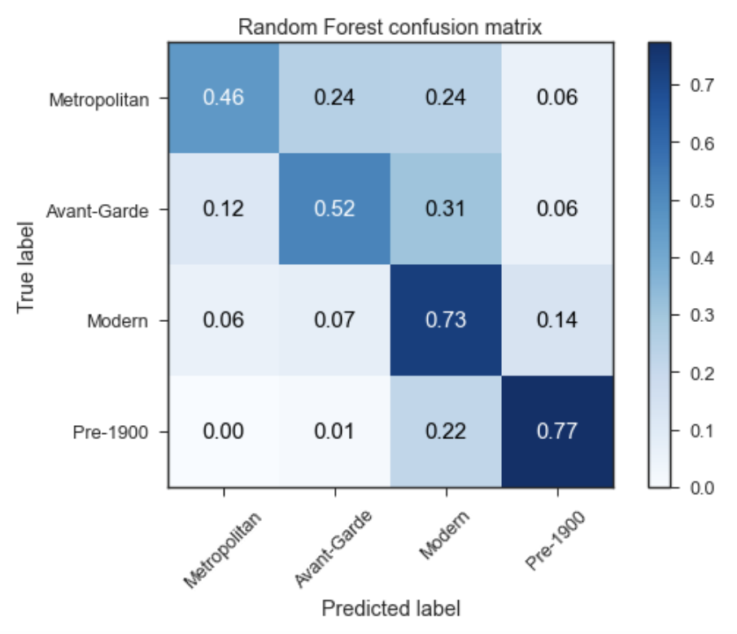
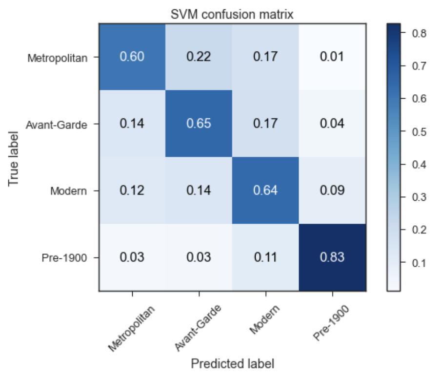
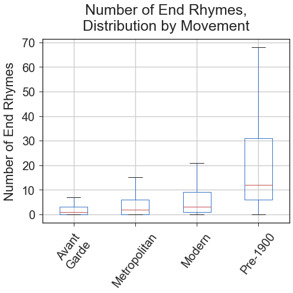
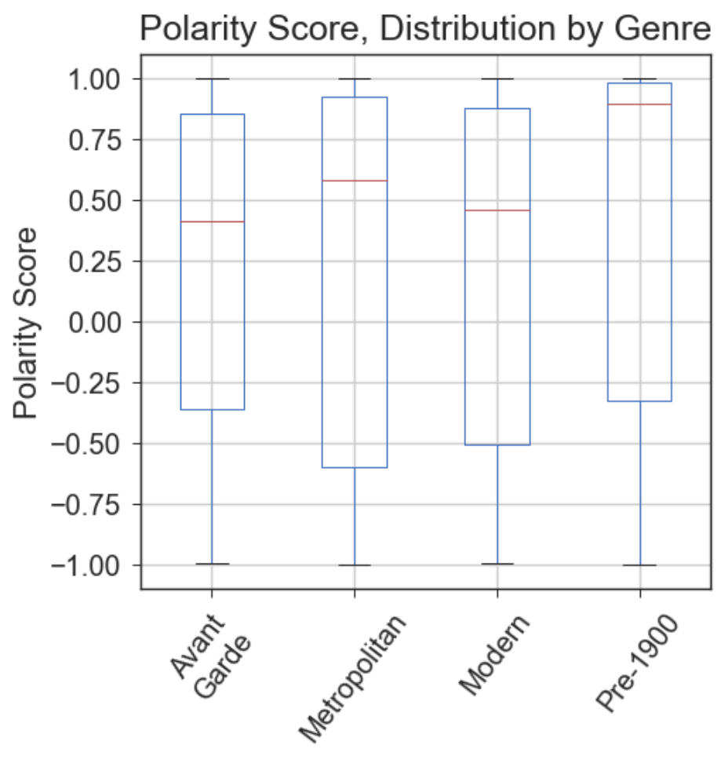
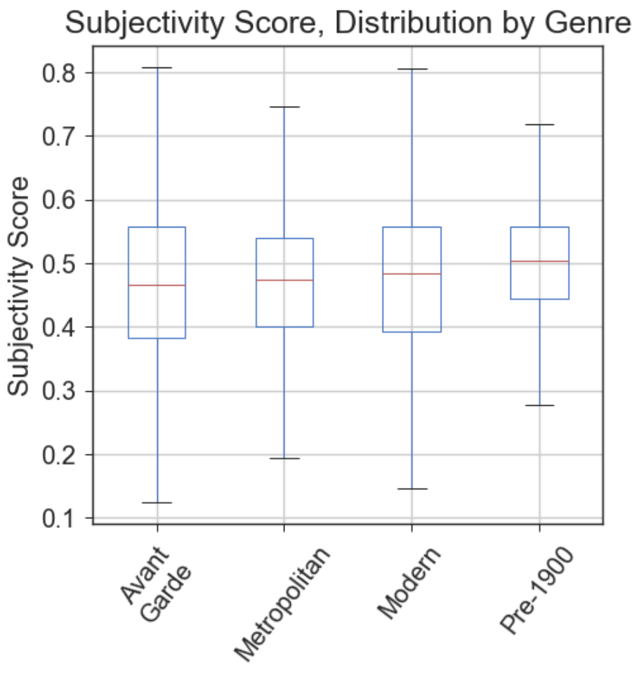
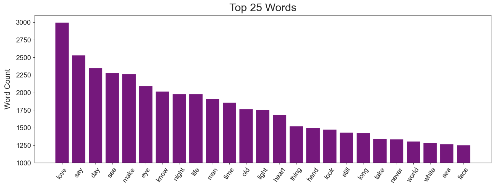
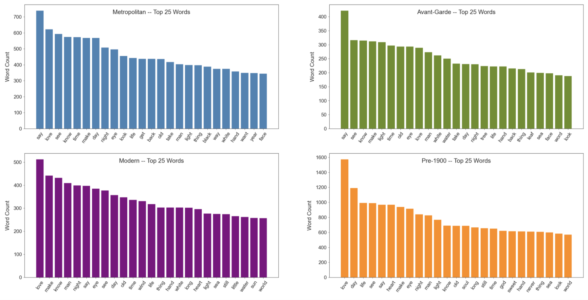
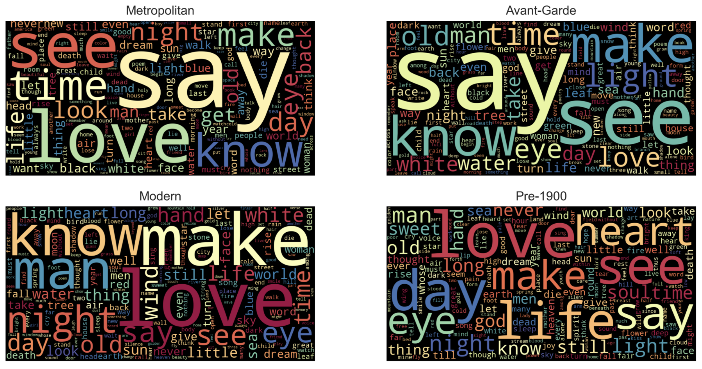

# Predicting Poetic Movements

## Approach
After scraping [Poetry Foundation](https://www.poetryfoundation.org/) for poems within certain genres, I perform natural language processing (NLP) techniques to analyze the characteristics and word usage of four self-determined poetic movements: pre-1900 (Victorian and Romantic), Modern (a standalone category), Metropolitan (New York School [1st and 2nd Generation], Confessional, Beat, Harlem Renaissance, Black Arts Movement), and Avant-Garde (Imagist, Black Mountain, Language Poetry, Objectivist). Through text processing, feature engineering, and exploratory data analysis, I discover insights into how important words and structure relate to genre. I then create predictive models to provide further insight and confirm my findings during EDA.

### Some questions:

* How does the sentiment of tweets change over time?
    * Hypothesis: Tweets will be more negative on average in January and get more positive on average as time goes on.
* Will Twitter stats (number of likes, replies, retweets) play a role in determining sentiment?
    * Hypothesis: The most important features will most likely be the words themselves.
* Does topic modeling provide any insight toward tweet sentiment or the COVID-19 crisis?
    * Hypothesis: Topic modeling should be a factor in determining sentiment and can give us insights into the pandemic.
* What insights can be provided by using machine learning?
    * Hypothesis: The lion's share of the insights will come during EDA.
* What are the most frequent words? And do they play a role in determining sentiment?

## Findings and future considerations
- Pre-1900 poetry is easily recognized
    - High number of end rhymes, most words per line, and simpler words (fewer syllables per word)
- Avant-garde is the polar opposite
    - Practically no end rhymes, fewest words per line, and more complex words (more syllables per word)
- Poetry is rarely neutral (and generally positive) and fairly equally subjective/objective
- Lots of visual and temporal vocabulary
- Form/structure is important for prediction (especially Random Forest models)
    - Further exploration desired
        - Other types of rhyme
        - Use of line breaks, tabs, and spacing
        - Topic modeling
- SVM relies mostly on vocabulary
    - Further exploration desired
        - Word embeddings (self-trained and pre-trained)
        - POS tagging

- Some of the words that the SVM model weighed the heaviest were surprising, given that they were mostly not among the top words overall:
    - among
    - black
    - get
    - dream
    - look
    - cry
    - crazy
    - leaf
    - sing

## 10 most common words after removing stopwords (# of appearances:
    'love'  (2,996)
    'say'   (2,528)
    'day'   (2,345)
    'see'   (2,275)
    'make'  (2,260)
    'eye'   (2,091)
    'know'  (2,013)
    'night' (1,977)
    'life'  (1,975)
    'man'   (1,911)

## Most prevalent features in the Random Forest model: (in order of magnitude)
    End rhymes (total)
    Words per line (average)
    Syllables per word (average)
    Lines (total)
    Polarity score
    Subjectivity score
    'heart'
    'get'
    'day'
    'sweet'

### 10 best features (SVM): (in order of magnitude)
    Words per line (average)
    among
    black
    get
    dream
    look
    cry
    crazy
    leaf
    sing

# Final conclusion
##### 

The overall sentiment of tweets was fairly evenly divided between positive and negative throughout the five months. There were some interesting results from our prediction models, namely that some continuous variables like subjectivity score, number of likes, and number of replies were some of the most important variables for predicting a tweet's sentiment. Other important features were words with high frequencies. Given more time we would try to get better accuracy via a deep learning model, including an LSTM model. And finally, we would like to further investigate sentiment toward the work mask (or masks) in particular as opposed to the overall sentiment of the tweet as a whole.

## List of files
- **.gitignore** - list of files and pathways to ignore
- **01_webscraping_notebook.ipynb** - notebook of scraping, compiling, and cleaning my datasets and corpus
- **02_eda_processing_feature_engineering.ipynb** - notebook with feature engineering, EDA, text processing, and chart/visualization creations
- **03_modeling_notebook.ipynb** - notebook with Naive Bayes, Decision Tree, Random Forest, and SVM models
- **04_word_embeddings_modeling_notebook.ipynb** - notebook with word embeddings (training and pre-trained) and neural networks
    - NOTE: so far unsuccessful, i.e. worse than Naive Bayes
- **functions.py** - file with functions used in feature engineering, EDA, modeling, and visualizations for this project
- **functions_webscraping.py** - file with functions used in webscraping and data cleaning
- **presentation.pdf** - slides for my presentation of this project
- **README.md** - this very file!
- **archives** folder - old jupyter notebooks, mostly scrap
- **charts** folder - charts and visualizations created during the project
- **data** folder - datasets, corpora, and models

## Visualizations
- Random Forest Confusion Matrix:

- SVM Confusion Matrix:

- Average Line Length (by genre):

- Number of Lines (by genre):

- Average Number of Syllables per Word (by genre):

- Number of End Rhymes (by genre):

- Presence of End Rhymes (by genre):

- Ratio of End Rhymes to Line Count (by genre):

- Polarity Score (by genre):

- Polarity (by genre):

- Subjectivity Score (by genre):

- Subjectivity Score (by genre):

- Top 25 Words by Frequency (overall):

- Top 25 Words by Frequency (by genre):

- Word Cloud (overall):

- Word Cloud (by genre):

### BLOG POST FORTHCOMING

